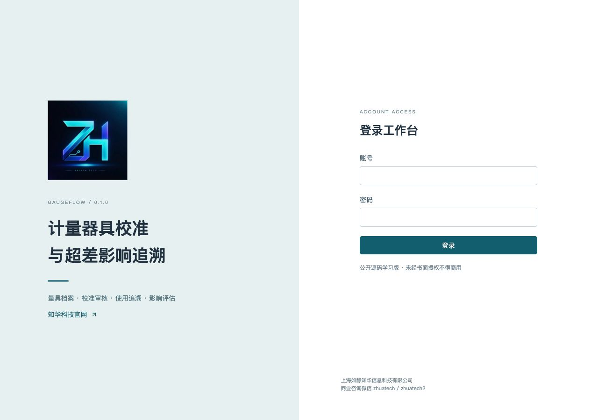
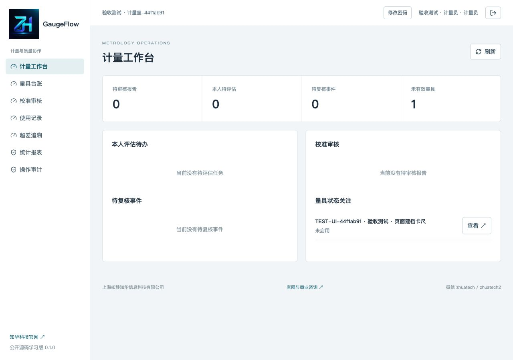
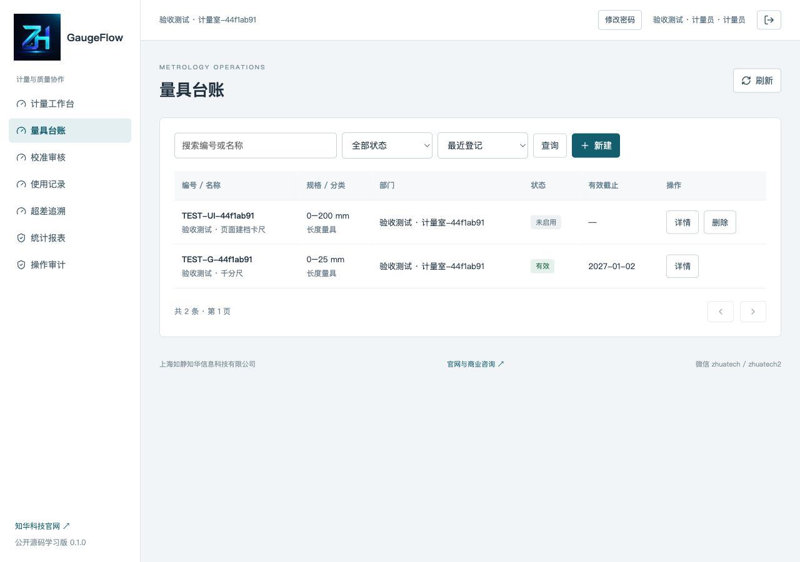
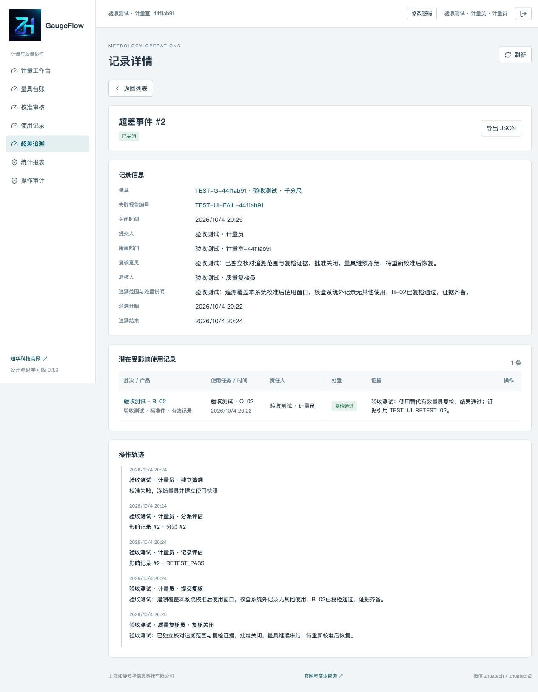
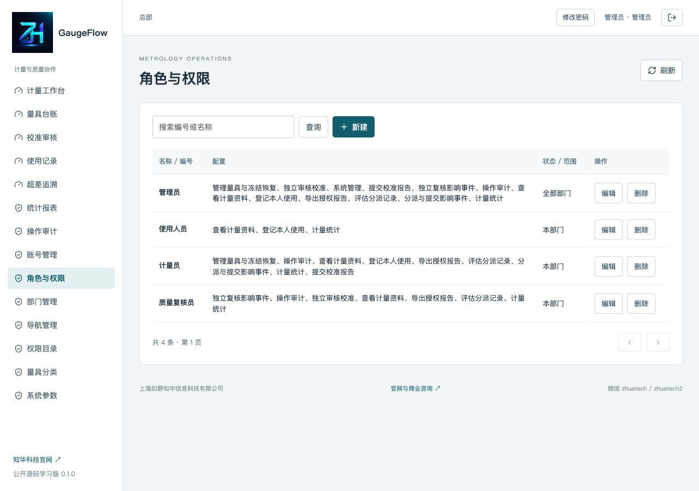
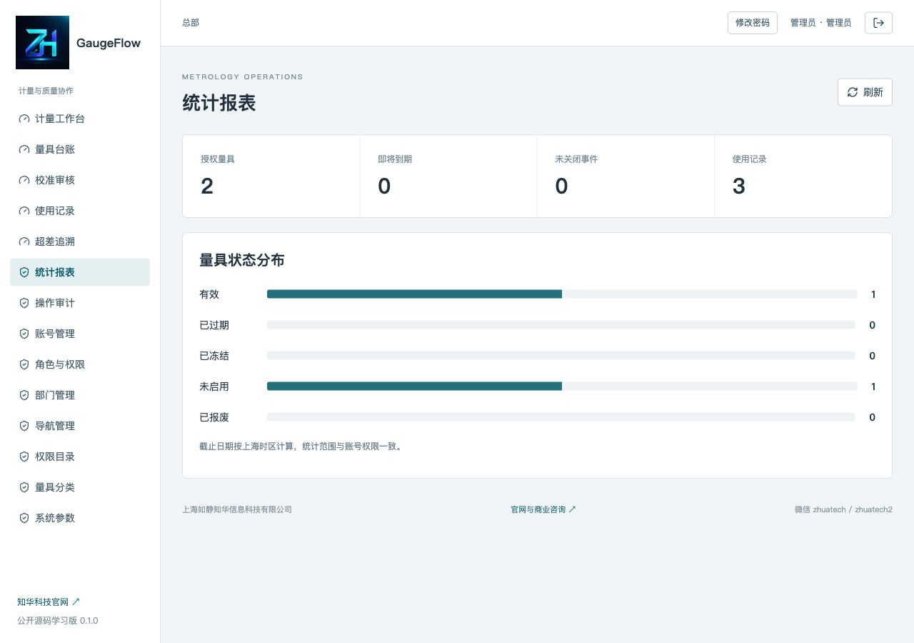

[中文](README.md) | [English](README.en.md)

# GaugeFlow · Gauge Calibration and Out-of-Tolerance Traceability


**Public source for learning 0.1.0 / non-commercial use** · **ZhiHua Technology (Shanghai Rujing Zhihua Information Technology Co., Ltd.)** · [Official website](https://www.zhuatech.cn/)

Java 21 / Spring Boot, Vue 3, MySQL and Flyway provide calibration review, gauge use and out-of-tolerance impact traceability. When calibration fails, metrology teams need to stop use, identify prior inspection/product records and retain impact judgments/retest evidence. GaugeFlow supports manufacturing metrology, inspection and independent quality reviewers.

Own source is for personal learning, technical research and non-commercial exchange only. Commercial use requires prior written authorization; see [LICENSE](LICENSE). Third-party licenses apply separately.

## A traceable metrology workflow

```text
Gauge registration → passing report submission → independent review → current use
Failure registration → immediate software quarantine + use snapshot → assign assessments
                     → submit → independent return or close
All incidents closed + later passing calibration independently accepted and valid
                     → separate authorization to release gauge
```

Uses record product, batch, inspection task, actor, server timestamp and the report effective at that time. Submitted reports are immutable; pending reports block new use. Rejecting a failure report does not remove quarantine or traceability.

The snapshot window starts at the last independently accepted passing calibration time and ends when the failure is registered. It includes uses between calibration and registration, and original voided uses. Without a passing report, it starts at gauge creation. This covers only recorded uses; submission must include external-record checks/scope. These are **potentially affected records**, not an automatic product rejection.

| Module | Implemented operations |
|---|---|
| Gauges | Types, references/models/departments, search/state filters/database paging/sort; deletion only without calibration references; protected historical identity and retirement history |
| Calibration review | Report/provider/reference, calibration time, PASS/FAIL, valid-until date and text evidence; independent approve/reject; strictly increasing report times |
| Uses | Personally record current use; no valid report, quarantine, expiry, retirement or pending review blocks it; reasoned voiding retains originals |
| Traceability | Frozen use snapshot, assigned assessor, NO_IMPACT / RETEST_PASS / REJECTED_PRODUCT evidence, submit/return/independent close |
| Release | All incidents closed, later passing independently accepted unexpired report and no pending reports, then separate release |
| Workspace/statistics | Personally assigned assessments, pending reports/reviews, abnormal gauges, validity/expiry windows and use counts |
| Administration | Accounts, roles, registered permissions, department scopes, built-in menus, type dictionaries/settings, audit and own password |
| Reports | Scoped JSON details/evidence/history without inserted advertising or unrelated customer data |

### Business and administrative roles

- **Users:** department records, own current uses and authorized statistics.
- **Metrology staff:** department gauges/reports, assessment assignment/work, incident submission, release and retirement.
- **Quality reviewers:** department reports/incidents and personally assigned assessments. Report submitters cannot self-review. An incident creator or anyone who assessed it cannot close or return it.
- **Administrators:** ALL-department/system directories, still subject to independence rules. Global directory management requires ALL scope.

Suitable for bounded teams with separate responsibilities. No certificate attachments, signatures, laboratory APIs, measurement uncertainty, MSA, instrument collection, SMS/email, multi-tenancy or ERP/MES integration. Evidence is text/references, not downloadable or fabricated certificates. Software quarantine blocks only GaugeFlow registrations; responsible people handle physical isolation and other systems. No mandatory paid models or external business services.

## Actual running pages

Acceptance records are explicitly synthetic test inputs, not actual products/laboratories/test conclusions. Empty installation creates no gauges or uses.

### Login



Login: real account authentication into an authorized workspace.

### User workspace



Workspace: personally assigned assessments and authorized metrology work.

### Gauge records



Gauges: current state, effective report and enablement requirements.

### Out-of-tolerance impacts



Incident: potentially affected use snapshots, assignment, assessment and independent review.

### Administrative permissions



Roles: interface permissions and ALL/department scopes.

### Authorized statistics



Statistics: validity, expiry windows and recorded use counts.

## Architecture, runtime and directory structure

Browser → Nginx :8080 → same-origin Spring Boot :8080 → MySQL 8.4 / Flyway / JPA.

| Layer | Runtime |
|---|---|
| Backend | Java 21, Maven 3.9, Spring Boot 4.0.7, Security, Data JPA and Flyway; MariaDB JDBC 3.5.10 accesses MySQL |
| Frontend | Node.js 24.19.0+, Vue 3.5.40, Vite 8.1.5, Lucide 1.48.0, ESLint and Prettier |
| Deployment | Docker Engine, Compose v2, BuildKit, MySQL 8.4 and Nginx 1.29 |
| Tests | JUnit/MockMvc, H2 MySQL mode, separate actual MySQL acceptance and Node tests |

```text
backend/             Identity, administration, metrology rules and transactions
  src/main/resources/db/migration/  V1 identity and V2 metrology
  src/test/          Date policies and HTTP/transaction tests
frontend/            Vue operation pages, requests and state-action tests
compose.yaml         Dedicated MySQL volume and health dependencies
scripts/             Private configuration, isolated acceptance and release scan
docs/                Operations, API, schema, architecture, security, deployment and tests
```

Writes lock the base department, refresh current roles and check versions/state at READ COMMITTED. This serializes a small learning deployment, without a high-concurrency claim. Account/payload-bound UUID commands prevent duplicate report/use/incident writes on exact retry. Core lists filter/page/sort in the database; directory/statistics/options are bounded at 10,000. Details/history are not paginated and need further archival/paging for large data. See [Architecture](docs/architecture.md); linked manuals are currently in Chinese.

## Requirements and first startup

Docker, Compose v2 and Python 3. Initial builds require official image/public dependency access. Username `admin`; no fixed demo password. The script creates three independent strong passwords in ignored local `.env`, mode 0600, refusing overwrite. If configuration exists, start directly.

```sh
python3 scripts/init-env.py
docker compose -p gaugeflow-local config --quiet
docker compose -p gaugeflow-local up -d --build --wait
```

Open [http://127.0.0.1:8105/](http://127.0.0.1:8105/); [health](http://127.0.0.1:8105/actuator/health). Read local `ADMIN_PASSWORD`. An empty database applies V1/V2 and initializes headquarters, four roles, permissions/menus, three gauge types, three settings and the administrator. Restarts retain facts/passwords.

Create departments, staff, users and an independent reviewer, then register actual gauges/calibration facts. See [Operations](docs/operations.md).

### Configuration and development

[.env.example](.env.example) lists names without credentials.

| Name | Purpose |
|---|---|
| `DATABASE_PASSWORD` | Dedicated gaugeflow database user password |
| `MYSQL_ROOT_PASSWORD` | Initial database administration password |
| `ADMIN_PASSWORD` | Empty-database admin only, never resets an existing account |
| `WEB_PORT` | Default 8105; override occupied ports |
| `BIND_ADDRESS` | Default 127.0.0.1; external access needs HTTPS |
| `COOKIE_SECURE` | false for local HTTP, true for HTTPS |

Host development: Java 21 / Maven 3.9 with controlled `DATABASE_URL`, `DATABASE_USER`, `DATABASE_PASSWORD` and `ADMIN_PASSWORD` pointing to a dedicated database:

```sh
mvn -f backend/pom.xml spring-boot:run
```

In another repository-root terminal, with Node 24.19.0+ / npm 11:

```sh
cd frontend
npm ci
npm run dev
```

Development binds loopback and proxies backend 8080. Default Compose publishes neither database nor backend ports; host development needs a separate database/private loopback mapping, while full Compose is suitable locally. Host source does not automatically load `.env`. Keep real secrets out of source/history.

## Database initialization, deployment and upgrades

Database `zhuatech_gaugeflow`, MySQL 8.4. V1 initializes identity/directories and V2 adds gauges, calibration, uses, incidents, impacts, events/commands. Foreign keys, unique indexes and versions protect relationships. Timestamp facts use UTC microseconds; the interface uses Shanghai time. Valid-until is a DATE, inclusive of that Shanghai day. Expiry derives on reads/use checks without a scheduling service.

Flyway owns schemas; JPA validates only. Before upgrades pause writes, retain application/private configuration versions, back up the complete database and validate restoration on a separate copy. Add V3/higher; preserve applied files/history. Check Flyway success, health, login and original facts/scopes before switching. Application rollback does not automatically reverse schema changes. See [Database](docs/database.md) and [Deployment](docs/deployment.md).

Backups include account hashes and report/use/impact evidence; keep restricted outside public source, mode 0600, without printing secrets/content. Restore into a new Compose project, fresh MySQL volume and distinct web port. Start MySQL, import the complete backup, then start matching applications. Verify migration history, original accounts, reports, uses, closed assessments and permissions before switching. External hosting requires authorization, HTTPS, secure cookies, network isolation, least privilege, verified database connections, backups and monitoring. `down` retains volumes; remove volumes only for explicitly disposable tests.

## Validation

From the repository root:

```sh
cd frontend
npm ci
npm run format:check
npm run lint
npm test
npm run build
cd ../backend
TEST_ADMIN_PASSWORD="Aa9$(python3 -c 'import secrets;print(secrets.token_hex(20))')" mvn spotless:check test package
cd ..
docker compose -p gaugeflow-check config --quiet
docker compose -p gaugeflow-check up -d --build --wait
python3 scripts/smoke.py --run
docker compose -p gaugeflow-check restart mysql
docker compose -p gaugeflow-check up -d --wait mysql
docker compose -p gaugeflow-check restart backend
docker compose -p gaugeflow-check up -d --wait backend
docker compose -p gaugeflow-check restart frontend
docker compose -p gaugeflow-check up -d --wait
python3 scripts/smoke.py --verify
python3 scripts/release-check.py
git diff --check
```

Use `gaugeflow-check` with a **fresh isolated disposable database**. Smoke mode creates synthetic acceptance accounts/records and writes private ignored `.smoke-state.json`, refusing to overwrite state. For another local test/recovery port, pass `--url`. Never run against actual business data or publish private credentials. Existing private test state must be retained or handled in its original test workflow.

There are eight date-policy tests, 26 integration tests and 11 frontend tests. Checks cover complete trace/recovery, rejected failure still quarantined, expiry, pending review, snapshot windows, voided uses, independence, assignments, scopes, stale versions, exact retries and use/freeze concurrency. Integration credentials are dynamically generated in isolated H2; H2 does not replace MySQL. Images execute all tests. See [Testing](docs/testing.md).

## Troubleshooting, security and feedback

| Symptom | Check |
|---|---|
| Startup fails | This project's port, variables and logs; preserve actual volumes |
| Login fails | Empty-database initial password/latest change; backend restart requires login |
| Report rejected | Retain facts, submit a later report with increasing time; failed-report incidents still need closure |
| Use rejected | Current validity, quarantine/expiry/retirement and pending reports |
| Cannot submit incident | Every impact assessed with evidence and complete scope explanation |
| Cannot review | A reviewer independent of creator and every assessor |
| Cannot release | Closed incidents, later passing independently accepted unexpired calibration and no pending reports |
| Version conflict | Refresh/review; never reuse a UUID for different input |

HttpOnly/SameSite Strict sessions, CSRF and BCrypt cost 12 protect identity. Backend checks role, department and enabled status; disablement/password reset invalidate sessions. JSON exports inherit detail scopes. Keep credentials, customer records, backups and unredacted logs out of source. See [Security](docs/security.md).

Submit reproducible redacted issues and checked contributions preserving copyrights. Privately report vulnerabilities without public credentials/exploit payloads. Third-party licenses are retained in [docs/licenses](docs/licenses) and static notices. This application does not issue calibration certificates, infer product quality or replace professional metrology, impact review or physical isolation. Operators validate their business, capacity, backup recovery and deployment.

## License and contact ZhiHua Technology

Own code uses [ZhuaTech Non-Commercial Source License 1.0](LICENSE), permitting personal learning, technical research and non-commercial exchange only. **Commercial use requires prior written authorization from Shanghai Rujing Zhihua Information Technology Co., Ltd.** Enterprise private deployment, paid delivery/services, SaaS, resale and in-depth customization require authorization. Preserve attribution, website, copyright, license and licensing contacts. Third-party licenses remain separate. This is publicly readable non-commercial source, not an OSI-approved license; software is provided as is with no unverified production-readiness claim.

For commercial licensing, in-depth custom development, deployment or system integration, contact **ZhiHua Technology (Shanghai Rujing Zhihua Information Technology Co., Ltd.)**:

- Website: [https://www.zhuatech.cn/](https://www.zhuatech.cn/)
- Email: [han@zhuatech.cn](mailto:han@zhuatech.cn)
- Email: [jack@zhuatech.cn](mailto:jack@zhuatech.cn)
- WhatsApp: [+86 17521234993](https://wa.me/8617521234993)
